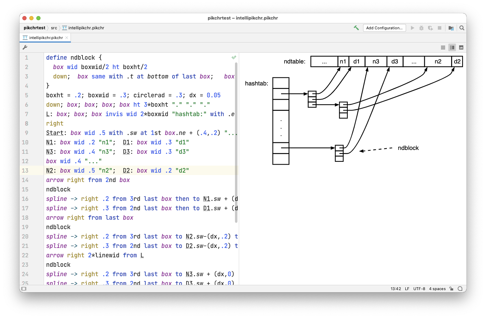

# IntelliPikchr

Support [Pikchr](https://pikchr.org/) language in IntelliJ-based IDEs (2021.3 and later).

_Pikchr (pronounced "picture") is a PIC-like markup language for diagrams in technical documentation._
                   

## Features
 
- Syntax highlighting, customizable in _Settings \| Editor \| Color Scheme \| Pikchr_
- Bundled Live Templates, customize/add in _Settings \| Editor \| Live Templates_
- Split editor with preview pane for `.pikchr` files, using [kroki.io](https://kroki.io) or self-hosted server for rendering
- Adapt preview colors to IDE dark UI mode
- Tune preview with custom CSS
- See _Settings \| Languages & Frameworks \| IntelliPikchr_ to customize (see Settings icon in editor toolbar)

### Plans/Ideas

- Full language support (semantic highlighting, completion, refactoring, ...)
- Previews for diagrams embedded in Markdown code fences

## Installation
            
- Open [Plugin Homepage](https://plugins.jetbrains.com/plugin/17624-intellipikchr) and click *Install to...* button on upper right

- Using IDE built-in plugin system:

  <kbd>Settings</kbd> > <kbd>Plugins</kbd> > <kbd>Marketplace</kbd> > <kbd>Search for "IntelliPikchr"</kbd> >  <kbd>Install Plugin</kbd>

- Manually:

  Download the [latest release](https://github.com/YannCebron/IntelliPikchr/releases/latest) and install it manually
  using
  <kbd>Settings</kbd> > <kbd>Plugins</kbd> > <kbd>⚙️</kbd> > <kbd>Install plugin from disk...</kbd>
                             
## License | Code of Conduct | Credits

Licensed under [Apache 2 License](LICENSE)

[Contributor Covenant Code of Conduct](CODE_OF_CONDUCT.md)
                                      
Split editor adapted from IntelliJ IDEA [Markdown plugin](https://github.com/JetBrains/intellij-community/tree/master/plugins/markdown)

---
Plugin based on the [IntelliJ Platform Plugin Template][template].

[template]: https://github.com/JetBrains/intellij-platform-plugin-template
